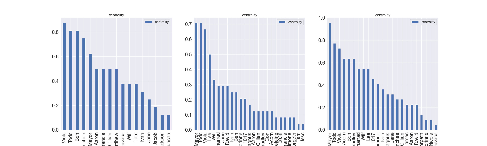
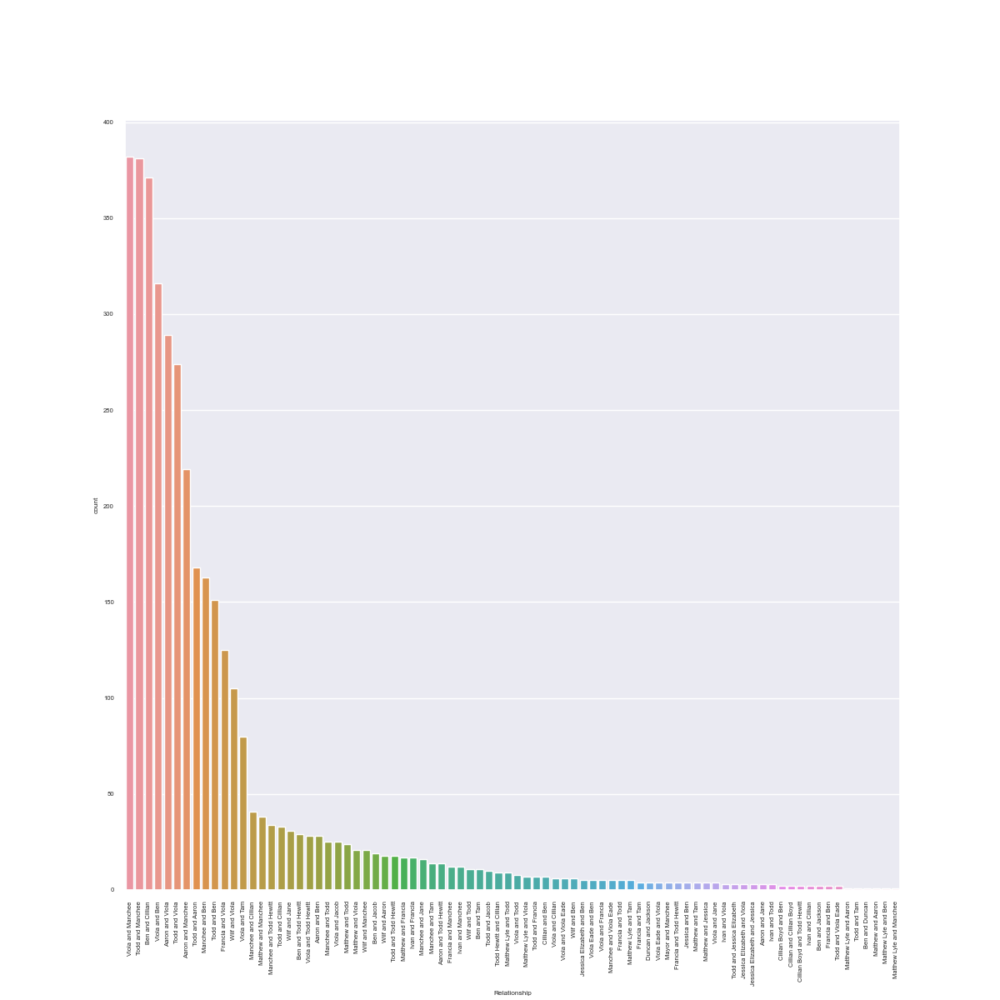
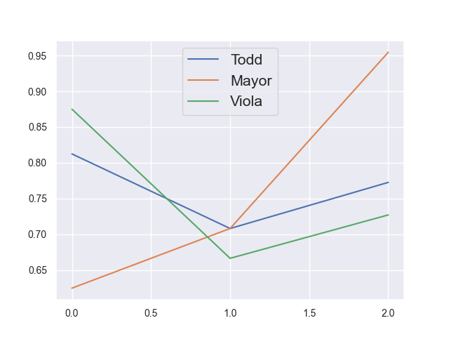

# Network-Analysis-of-Chaos-Walking-Series: Project Overview
- Analyze relevancy and significance of characters and character relationships throughout the series
- Scrap character names from fandom wiki pages
- Visualize relationships and characters as a networks graph to express importance of characters and relationshops (Characters as nodes and relationship as an edge)
- Perform Louvain Community Detection Algorithm to determine the different communites through out the series.
- Analyze the accuracy of graph based on the knowledge of reading the series.

## Table of Contents
- [Dataset and Data Cleaning](#dataset-and-data-cleaning)
- [Exploratory Network Analysis](#exploratory-network-analysis)
  * [Graph](#graph)
    + [Other Graphs](#other-graphs)
  * [Findings](#findings)
- [Conclusion](#conclusion)
- [Next Steps](#next-steps)
- [Code and Resourced Used](#code-and-resourced-used)

## Dataset and Data Cleaning
- The data was scrapped using selenium and performed using this script. Information on how to scrape data from wiki fandom pages are found [here](https://chaoswalking.fandom.com/wiki/Category:Characters)
- Data was filtered for unique characters and characters containing First and Last names were split into new columns. Abbreviations and punctuation were removed
- Entities were detected for each sentence and converted into dataframe. Dataframe was then filtered with only character entitites
- Relationships between 2 entitites within a 5 sentence rolling window were recorded and turned into a dataframe. 

## Exploratory Network Analysis
### Graph
XNA was performed on the given txt files. Entities were detected using spacy and were filtered leaving only characters Entities. Connections were also established between characters if 2 characters were mentioned within 5 sentences. 

### Other Graphs

  <a href="about.html" title="Knife of Never Letting Go">Knife of Never Letting Go</a>
   
  <a href="about.html" title="The Ask and The Answer">The Ask and The Answer</a>
   
  <a href="about.html" title="Monsters of Men">Monsters of Men</a>

### Findings
Based on first book on the series [Knife of Never Letting Go](https://github.com/aaronkrishh/Network-Analysis-of-Chaos-Walking-Series/blob/main/Books/1_the_knife_of_never_letting_go_-__book_in_pdf__patrick_ness.txt), we are able to determine each nodes degree centrality of each node. The degree centrality reperesents how important each node is within the graph (A higher number indicates an important node). In the context of the study, this will tell us which characters are the most important throughout the series

We can also see that Viola, Todd and Manchee are most relevant relationships through out the book. Given they are the 3 main protagonist, it makes sense.

## Conclusion
We are able to see the progress characters through out the series and how some character more or less relevant. Analyzing the 3 main characters (The Mayor, Todd and Voila), we can see that the main antagonist the Mayor became more prevelant as the series was coming to a conclusion. This matches the description of the story as the climax of the series is the battle between the Mayor and Todd.

## Next Steps
- Build a model to predict protagonists and antagonists. Using their degree centrality and sentiment analysis on quotes they have said.
- Remove edges with small weights as they are to be seen as insignificant or weak relationships between 2 characters.
- Try different community detection algorithms such as Leiden Community detection.

## Code and Resourced Used
- Python Version 3.8
- Packages: Pandas, Numpy, Spacy, Seaborn, Matplotlib, Selenium, Regex, Spacy, Networkx
- [[Character Data]](https://chaoswalking.fandom.com/wiki/Category:Characters)
- [[Structure and Formating of Project]](https://github.com/thu-vu92/the_witcher_network)

